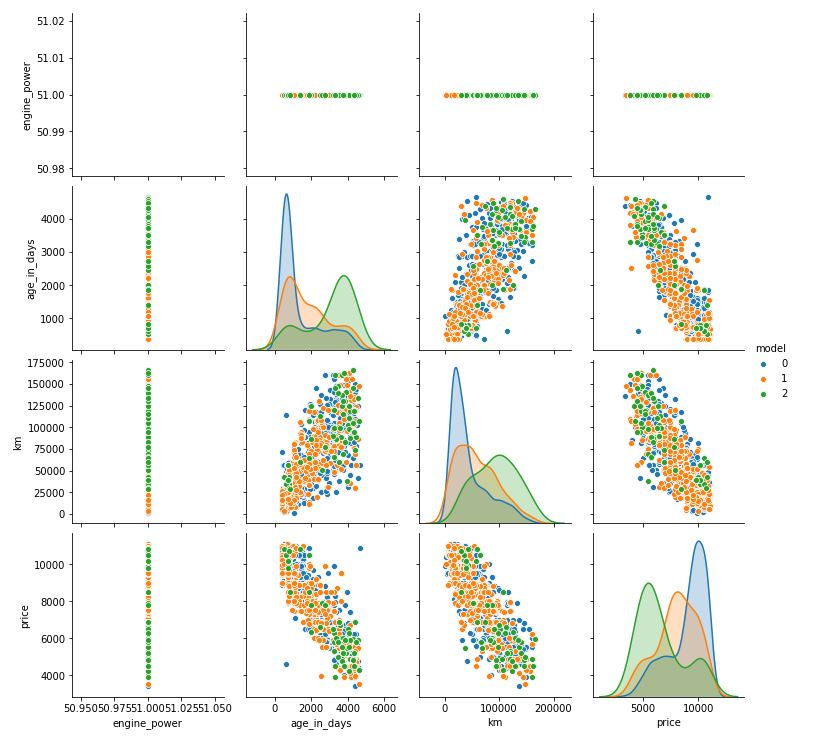
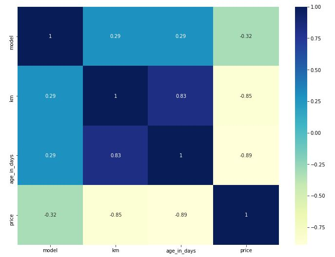
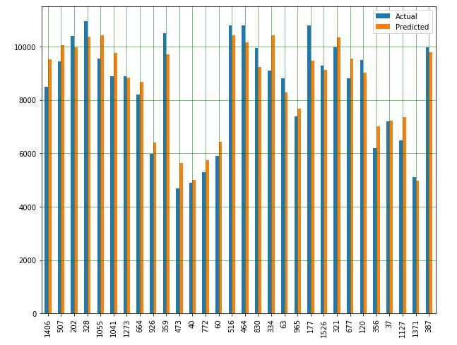

# Predicting the prices of Fiat 500 with Linear Regression

## Introduction

The purpose of this model is to apply the Linear Regression in order to predic the prices of three differen classes of Fiat 500. The dataset comes from [Kaggle.](https://www.kaggle.com/)

## Description of the dataset

- model:'pop', 'lounge', 'sport'

- engine_power: number of Kw of the engine

- age_in_days: age of the car in number of days (from the time the dataset has been created)

- km: kilometers of the car

- previous_owners: number of previous owners

- lat: latitude of the seller (the price of cars in Italy varies from North to South of the country)

- lon: longitude of the seller (the price of cars in Italy varies from North to South of the country)

- price: selling price (the target)

## Usage
```python
import sklearn 
from sklearn.model_selection import train_test_split
import seaborn as sns
import matplotlib.pyplot as plt
from matplotlib.pyplot import figure
import numpy as np
import scipy as sp
import pandas as pd
```
## Exploratory Data Analysis
scatter matrix for model, engine_power, age_in_days, km and price


correlation matrix for model, age_in_days, km and price


## Model performance - comparison between the actual values and the predicted values


## Score

- Training set score: 0.83
- Test set score: 0.85

## License
The dataset for this model comes from [Kaggle.](https://www.kaggle.com/)
